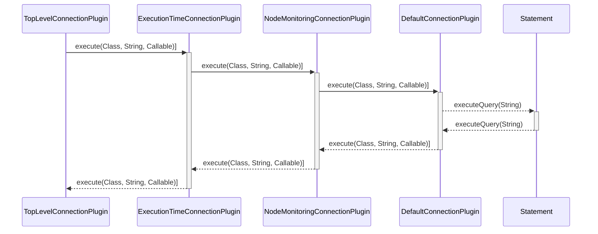

# AWS JDBC Driver for MySQL Custom Connection Plugin Sample Application

This README walks through the steps to create 2 additional custom connection plugins for the AWS
JDBC Driver for MySQL and use them in a simple JDBC application. All the code used in this README
are available within this directory, to run the sample application directly,
see [Running the Sample Code](#running-the-sample-code) section.

### Minimum Requirements

To following along this tutorial or to run this sample program directly, the following are required:

1. Amazon Corretto 8+ or Java 8+
2. A MySQL database
3. The AWS JDBC Driver for MySQL must be added to the classpath. To obtain the AWS JDBC Driver for
   MySQL
   see [here](https://github.com/awslabs/aws-mysql-jdbc#obtaining-the-aws-jdbc-driver-for-mysql).

## What are Connection Plugins

Connection plugins are widgets attached to each `Connection` objects to help execute SQL functions
related to that `Connection`. All the connection plugins are chained together, where the prior
connection plugin calls the next plugin. The AWS JDBC Driver for MySQL provides 2 default connection
plugins, the `NodeMonitoringConnectionPlugin` and the `DefaultConnectionPlugin`.
The `DefaultConnectionPlugin` executes the desired method invocation as is,
while `NodeMonitoringConnectionPlugin` uses background threads to monitor the connection for
efficient failure detection.

> **NOTE**: The `DefaultConnectionPlugin` will always be used and will always be the last plugin in
> the connection plugin chain.

## Creating Custom Connection Plugins

This tutorial will walk through the steps to create two connection plugins. The first connection
plugin is called `TopLevelConnectionPlugin`, it tracks the number of method calls throughout the
lifespan of the connection. The second connection plugin `ExecutionTimeConnectionPlugin` tracks the
total execution time of each type of the method calls. We will use the two custom plugins together
with the built-in plugins. The final connection plugin chain will look like the following:


Below is an example of the execution process of `Statement#executeQuery(str)`:



### Creating a Top Level Connection Plugin

All connection plugins have to implement the `IConnectionPlugin` interface.

```java
import com.mysql.cj.jdbc.ha.ca.plugins.IConnectionPlugin;
import com.mysql.cj.log.Log;

import java.sql.ResultSet;
import java.util.HashMap;
import java.util.Map;
import java.util.concurrent.Callable;

/**
 * This is a simple example for writing a custom connection plugin.
 * <p>
 * All connection plugins must implement the {@link IConnectionPlugin} interface. Since
 * all the connection plugins are chained together, the prior connection plugin needs to
 * invoke the next plugin.
 * Once registered, every connection will create an instance of this connection plugin.
 */
public class TopLevelConnectionPlugin implements IConnectionPlugin {
  private final IConnectionPlugin nextPlugin;
  private final Log logger;
  private final Map<String, Integer> methodCount = new HashMap<>();

  public TopLevelConnectionPlugin(IConnectionPlugin nextPlugin, Log logger) {
    this.nextPlugin = nextPlugin;
    this.logger = logger;
  }

  /**
   * All method calls related to the connection object will be passed to this method as
   * {@code Callable<?> executeSqlFunc}.
   * This includes methods that may be called frequently, such as:
   * <ul>
   *   <li>{@link ResultSet#next()}</li>
   *   <li>{@link ResultSet#getString(int)}</li>
   * </ul>
   */
  @Override
  public Object execute(
      Class<?> methodInvokeOn,
      String methodName,
      Callable<?> executeSqlFunc) throws Exception {
    // Increment the number of calls to this method.
    methodCount.merge(methodName, 1, Integer::sum);
    // Traverse the connection plugin chain by invoking the `execute` method in the
    // next plugin.
    return this.nextPlugin.execute(methodInvokeOn, methodName, executeSqlFunc);
  }

  /**
   * This method is called when the connection closes.
   * If this connection plugin has any background threads this is the time to clean up
   * these dangling resources. However, you can also perform other steps you wish before
   * closing the plugin. This sample outputs all the aggregated information during this
   * step.
   */
  @Override
  public void releaseResources() {
    // Output the aggregated information from all methods called throughout the lifespan
    // of the current connection.

    final String leftAlignFormat = "| %-19s | %-10d |\n";
    final StringBuilder logMessage = new StringBuilder();

    logMessage
        .append("** TopLevelConnectionPlugin Summary **\n")
        .append("+---------------------+------------+\n")
        .append("| Method Executed     | Frequency  |\n")
        .append("+---------------------+------------+\n");

    methodCount.forEach((key, val) -> logMessage.append(String.format(
        leftAlignFormat,
        key,
        val)));
    logMessage.append("+---------------------+------------+\n");
    logger.logInfo(logMessage);

    methodCount.clear();

    // Traverse the connection plugin chain by calling the next plugin. This step allows
    // all connection plugins a chance to clean up any dangling resources or perform any
    // last tasks before shutting down.
    // In this sample, `ExecutionTimeConnectionPlugin#releaseResources()` will be called
    // to print out the total execution time of each method.
    this.nextPlugin.releaseResources();
  }
}
```

### Creating the Second Connection Plugin

The next custom plugin is the `ExecutionTimeConnectionPlugin`, which tracks the time spent executing
the given method in the remaining plugins.

```java
import com.mysql.cj.jdbc.ha.ca.plugins.IConnectionPlugin;
import com.mysql.cj.log.Log;

import java.util.HashMap;
import java.util.Map;
import java.util.concurrent.Callable;
import java.util.concurrent.TimeUnit;

/**
 * This connection plugin tracks the execution time of all methods executed with
 * enhanced instance monitoring enabled.
 * During the cleanup phase when {@link ExecutionTimeConnectionPlugin#releaseResources()}
 * is called, this plugin logs all the methods executed and time spent on each execution
 * in milliseconds.
 */
public class ExecutionTimeConnectionPlugin implements IConnectionPlugin {
  final long initializeTime;
  final IConnectionPlugin nextPlugin;
  private final Log logger;
  private final Map<String, Long> results = new HashMap<>();

  public ExecutionTimeConnectionPlugin(
      IConnectionPlugin nextPlugin,
      Log logger) {
    this.nextPlugin = nextPlugin;
    this.logger = logger;

    initializeTime = System.currentTimeMillis();
  }

  @Override
  public Object execute(
      Class<?> methodInvokeOn,
      String methodName,
      Callable<?> executeSqlFunc)
      throws Exception {
    // This `execute` measures the time it takes for the remaining connection plugins to
    // execute the given method call.
    // In this sample, the next connection plugin is the `NodeMonitoringConnectionPlugin`,
    // so this measurement includes the time it takes for the
    // `NodeMonitoringConnectionPlugin` to finish all its necessary setups.
    final long startTime = System.nanoTime();
    final Object result =
        this.nextPlugin.execute(methodInvokeOn, methodName, executeSqlFunc);
    final long elapsedTime = System.nanoTime() - startTime;
    results.merge(
        methodName,
        elapsedTime / 1000000,
        Long::sum);

    return result;
  }

  @Override
  public void releaseResources() {
    // Output the aggregated information from all methods called throughout the lifespan
    // of the current connection.
    final long elapsedTime = System.nanoTime() - initializeTime;
    final String leftAlignFormat = "| %-19s | %-10s |\n";
    final StringBuilder logMessage = new StringBuilder();

    logMessage.append("** ExecutionTimeConnectionPlugin Summary **\n");
    logMessage.append(String.format(
        "Plugin Uptime: %ds\n",
        elapsedTime / 1000000
    ));

    logMessage
        .append("** Method Execution Time With Enhanced Instance Monitoring **\n")
        .append("+---------------------+------------+\n")
        .append("| Method Executed     | Total Time |\n")
        .append("+---------------------+------------+\n");

    results.forEach((key, val) -> logMessage.append(String.format(
        leftAlignFormat,
        key,
        val + "ms")));
    logMessage.append("+---------------------+------------+\n");
    logger.logInfo(logMessage);

    results.clear();

    // Traverse the connection plugin chain by calling the next plugin. This step allows
    // all connection plugins a chance to clean up any dangling resources or perform any
    // last tasks before shutting down.
    // In this sample, `NodeMonitoringConnectionPlugin#releaseResources()` will be called
    // to release any running monitoring threads.
    this.nextPlugin.releaseResources();
  }
}
```

### Creating the Connection Plugin Factories

Before we can register the connection plugins in the `ConnectionPluginManager`, we need to create
factory classes that implements `IConnectionPluginFactory` interface.
Each `IConnectionPluginFactory`
implementation instantiates a specific connection plugin.

First is the `TopLevelConnectionPluginFactory`.

```java
import com.mysql.cj.conf.PropertySet;
import com.mysql.cj.jdbc.ha.ca.plugins.IConnectionPlugin;
import com.mysql.cj.jdbc.ha.ca.plugins.IConnectionPluginFactory;
import com.mysql.cj.jdbc.ha.ca.plugins.ICurrentConnectionProvider;
import com.mysql.cj.log.Log;

/**
 * This class initializes the {@link TopLevelConnectionPlugin}.
 */
public class TopLevelConnectionPluginFactory implements IConnectionPluginFactory {
  @Override
  public IConnectionPlugin getInstance(
      ICurrentConnectionProvider currentConnectionProvider,
      PropertySet propertySet,
      IConnectionPlugin nextPlugin,
      Log logger) {
    logger.logInfo(
        "[TopLevelConnectionPluginFactory] ::: Creating a simple top level connection plugin");
    return new TopLevelConnectionPlugin(nextPlugin, logger);
  }
}
```

Next is the `ExecutionTimeConnectionPluginFactory`.

```java
import com.mysql.cj.conf.PropertySet;
import com.mysql.cj.jdbc.ha.ca.plugins.IConnectionPlugin;
import com.mysql.cj.jdbc.ha.ca.plugins.IConnectionPluginFactory;
import com.mysql.cj.jdbc.ha.ca.plugins.ICurrentConnectionProvider;
import com.mysql.cj.log.Log;

/**
 * This class initializes {@link ExecutionTimeConnectionPlugin}.
 */
public class ExecutionTimeConnectionPluginFactory implements
    IConnectionPluginFactory {
  @Override
  public IConnectionPlugin getInstance(
      ICurrentConnectionProvider currentConnectionProvider,
      PropertySet propertySet,
      IConnectionPlugin nextPlugin,
      Log logger) {
    logger.logInfo(
        "[ExecutionTimeConnectionPluginFactory] ::: Creating a execution time connection plugin");
    return new ExecutionTimeConnectionPlugin(nextPlugin, logger);
  }
}

```

## Using the Custom Connection Plugins

This main application is a simple JDBC application. It uses creates a connection to a MySQL database
instance and executes a query with the several layers of connection plugins.

```java
import com.mysql.cj.jdbc.ha.ca.plugins.NodeMonitoringConnectionPluginFactory;

import java.sql.Connection;
import java.sql.DriverManager;
import java.sql.ResultSet;
import java.sql.SQLException;
import java.sql.Statement;
import java.util.Properties;

/**
 * This is a simple application for creating and using custom connection plugins.
 */
public class SampleApplication {
  private static final String PREFIX = "jdbc:mysql:aws://";
  private static final String CONNECTION_STRING = PREFIX + System.getenv("host");
  private static final String USER = System.getenv("user");
  private static final String PASSWORD = System.getenv("password");
  private static final String QUERY = System.getenv("query");

  public static void main(String[] args) throws ClassNotFoundException, SQLException {
    Class.forName("software.aws.rds.jdbc.mysql.Driver");
    final Properties properties = new Properties();
    properties.setProperty("user", USER);
    properties.setProperty("password", PASSWORD);
    properties.setProperty("logger", "StandardLogger");

    final String topLevelPlugin = TopLevelConnectionPluginFactory.class.getName();
    final String executionMeasurementPlugin =
        ExecutionTimeConnectionPluginFactory.class.getName();

    // NodeMonitoringConnectionPlugin is a built-in plugin with the Enhanced Instance
    // Monitoring feature.
    final String nodeMonitoringPlugin =
        NodeMonitoringConnectionPluginFactory.class.getName();

    // To use custom connection plugins, set the connectionPluginFactories to a
    // comm-separated string containing the fully-qualified class names of custom plugin
    // factories to use.
    properties.setProperty(
        "connectionPluginFactories",
        String.format("%s,%s,%s",
            topLevelPlugin,
            executionMeasurementPlugin,
            nodeMonitoringPlugin));

    try (Connection conn = DriverManager.getConnection(CONNECTION_STRING, properties)) {
      try (Statement statement = conn.createStatement()) {
        try (ResultSet result = statement.executeQuery(QUERY)) {
          final int cols = result.getMetaData().getColumnCount();
          while (result.next()) {
            for (int i = 1; i < cols; i++) {
              System.out.println(result.getString(i));
            }
          }
        }
      }
    }
  }
}

```

## FAQ

- Why does `IConnectionPlugin#execute(Class, String, Callable)` accepts the invoked method and the
  Java class calling this method instead of the actual object?
    - The `execute` method accepts the invocation class and the method call, such as
      `execute(ResultSet.class, "getString", () -> rs.getString(1))` because the Java class and the
  method name already provides enough details about the invoked method. Not passing the actual
  object prevents modification on the object,and avoids side effects when executing SQL functions in
  connection plugins.

## Running the Sample Code
